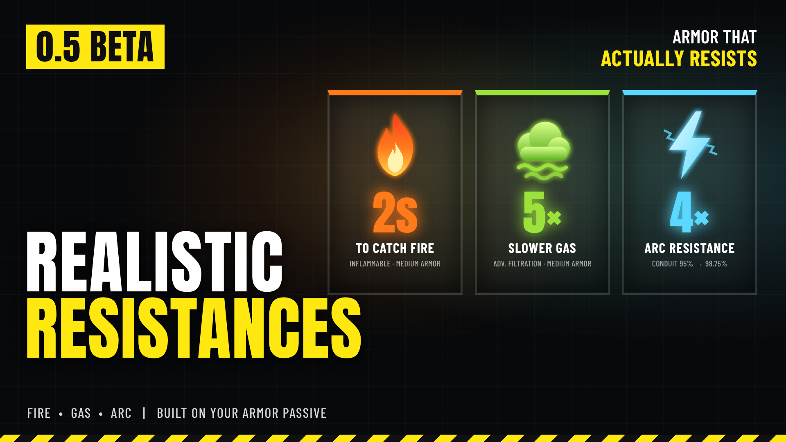

# Realistic Resistances



*Elemental resistances: fire, gas and arc. Beta (0.5).*

**Download:** `Realistic-Resistances-0.5.0.zip` from the [latest release](https://github.com/Th3chef/Realistic-Resistances/releases/latest) (not the source code). Needs [Bingus Shared Loader](https://www.nexusmods.com/helldivers2/mods/16292).

In the base game, an armor passive's fire, gas or arc resistance only cuts the damage. You still catch fire the moment a flame touches you, you still stumble out of every gas cloud, and an arc still stuns you for the full time. Real protective gear doesn't work like that. With this mod, the passive's own resistance also works against the **effect**, scaled by how heavy your armor is.

It only covers the elements for now (fire, gas and arc). Other damage types may come later.

## Fire

- **Harder to Ignite**: fire-resistant armor takes a flat time in the flames before you catch fire, like real fire-resistant clothing. A quick brush with fire no longer sets you alight.
- **Self-Extinguish**: once you're out of the flames, the burn runs out sooner, by the passive's fire resistance.

```
Passive               Catches fire (light / medium / heavy)   Burn after stepping out
Inflammable 75%       1.5 / 2 / 2.5 s                         0.75 s
Acclimated, KDM 50%   0.75 / 1 / 1.25 s                       1.5 s
Desert Stormer 40%    0.65 / 0.85 / 1.05 s                    1.8 s
Vanilla               about 0.25 s                            3 s
```

## Gas

- **Filtration Buffer**: gas-resistant armor slows the gas build-up, by the passive's gas resistance and your armor's weight (50% resistance: twice as long in medium armor). Once you're out of the cloud, the stumbling wears off sooner.
- **No Gas Slow**: with 80% gas resistance or more (Advanced Filtration), the gas stumbling and slowing never takes hold.
- A full-strength hit (a gas strike's blast, a gas grenade at your feet) still takes hold as normal; the resistance works on lighter clouds.

```
Passive                      Build-up slowed (light / medium / heavy)   Stumbling after stepping out
Advanced Filtration 80%      3.75 / 5 / 6.25x                           never (No Gas Slow)
Acclimated 50%               1.5 / 2 / 2.5x                             2.5 s
Desert Stormer 40%           1.25 / 1.67 / 2.08x                        3 s
Hazmat, Concussive Pad. 25%  1 / 1.33 / 1.67x                           3.75 s
Vanilla                      1x                                         5 s
```

## Arc

- **Resistance**: arc-resistant passives take a quarter of the arc damage they did (Electrical Conduit 95% becomes 98.75%), and the arc stun is cut to match the passive's resistance. The electric effect also holds off and wears off sooner.
- **Grounded** (Electrical Conduit only): arcs end at you instead of chaining on to your teammates.

```
Passive                          Arc damage resistance   Arc stun
Electrical Conduit 95%           98.75%                  0.075 s
Adreno-Defibrillator 50%         87.5%                   0.75 s
Acclimated 50%                   87.5%                   0.75 s
Desert Stormer 40%               85%                     0.9 s
Vanilla stun                                             1.5 s
```

## Options
In your mod manager (Arsenal / HD2 Mod Manager), each element is its own option with three choices:

- **Fire Resistance**: Harder to Ignite and Self-Extinguish / Only Harder to Ignite / Only Self-Extinguish
- **Gas Resistance**: Filtration Buffer and No Gas Slow / Only Filtration Buffer / Only No Gas Slow
- **Arc Resistance**: Resistance and Grounded / Only Resistance / Only Grounded

Keep **Core (required)** ticked. Arsenal: click the sliders (Options) button on the mod's row in your profile.

**In game:** with [Mod Options Menu](https://www.nexusmods.com/helldivers2/mods/16625) installed, the three options are also under ESC > MODS > REALISTIC RESISTANCES (Off plus the same choices), and a change takes effect at once. The picks in your mod manager are the starting values.

## Requirements
[Bingus Shared Loader](https://www.nexusmods.com/helldivers2/mods/16292).
Optional: [Mod Options Menu](https://www.nexusmods.com/helldivers2/mods/16625) to change the options in game.

## Install / update

1. Install [Bingus Shared Loader](https://www.nexusmods.com/helldivers2/mods/16292) if you don't have it.
2. Mod manager (Arsenal / HD2 Mod Manager): add the zip and enable it, pick your options, then **Purge** and **Deploy**.

## Uninstall
Disable it in your mod manager, then Purge and Deploy.

## Multiplayer

- Works hosting and joining. Nobody else needs the mod.
- Fire, gas and stun changes apply only to your own helldiver, wherever the fire, gas or arc came from.
- Arc damage and arc chaining are decided by the game that runs the arc. The arc damage boost and Grounded work on arcs your game runs: your own Tesla Towers and arc weapons, and enemy arcs when you host. Another player's Tesla Tower or arc weapon is run by their game, so it deals its normal damage to you and chains as normal.
- When you host, teammates wearing the same arc-resistant passive also get the arc damage boost against arcs your game runs (the game keeps one copy of each passive's values for everyone).

## Compatibility

- Bingus Shared Loader script; it doesn't replace any game files, so it works alongside armor, model and sound mods.
- Mods that change the same status effects or armor passive values may clash.
- Patch-proof by design: it finds what it needs in the game's code at start-up, so a game hotfix doesn't break it. If it can't find something after a patch it turns itself off and says why in its log, rather than guessing. Grounded is optional: if only its part isn't found, everything else still works.
- It only changes the game's data (status effect timers and passive values), never the game's code.

## Known limitations

- **Beta**: everything listed here has been tested, but not every armor, weapon and enemy combination. Please report anything odd.
- The game doesn't say what caused a stun, so while you wear arc resistance every small stun is shortened, not just the ones from arcs.
- Other players' Tesla Towers and arc weapons deal normal damage and chain as normal (see Multiplayer).
- Gas times depend on the cloud: a thicker cloud builds up faster, so it takes hold sooner. Fire catch times are flat.

## Troubleshooting

- Nothing changes: check Bingus Shared Loader is installed, Core (required) is ticked, and that you Purged and Deployed after installing.
- Attach the log to a bug report: *RealisticResistances.log* in %LOCALAPPDATA%\CowboyBingus\Helldivers2\Logs (type %LOCALAPPDATA% into the File Explorer address bar). It lists your options, the armor passive and weight it found, and what it did.

## Source

See [src/BUILDING.md](src/BUILDING.md).

## License

All rights reserved.
